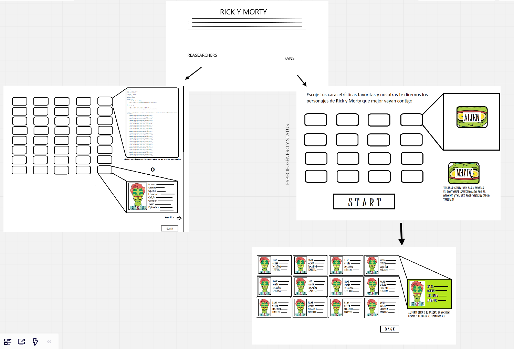

# DataLovers: Rick and Morty (prototipo)
​
El diseño de la app "Rick and Morty" se realizó con la finalidad de crear un juego que le permita a los usuarios encontrar a los personajes de la serie animada. Dicho juego está pensado para que cada usuario pueda combinar diferentes filtros y obtener los personajes que coincidan con su búsqueda.
​
En esta primera etapa de desarrollo el usuario puede visualizar la data, hacer filtros por género, status y specie, ver reflejados los personajes en tarjetas interactivas que le permiten ver información relevante de cada personaje y, finalmente, ordenar los datos alfabéticamente (ascendente y descendentemente).
​
## Resumen: Primera fase del proyecto
### Índice
​
* [1. Preámbulo](#1-preámbulo)
* [2. Resumen del proyecto](#2-resumen-del-proyecto)
* [3. Objetivos de aprendizaje](#3-objetivos-de-aprendizaje)
* [4. Criterios de aceptación del proyecto](#4-criterios-de-aceptación-del-proyecto)
* [5. Consideraciones técnicas](#5-consideraciones-técnicas)
***
​
### 1. Preámbulo
​
Según [Forbes](https://www.forbes.com/sites/bernardmarr/2018/05/21/how-much-data-do-we-create-every-day-the-mind-blowing-stats-everyone-should-read),
el 90% de la data que existe hoy ha sido creada durante los últimos dos años.
Cada día generamos 2.5 millones de terabytes de datos, una cifra sin
precedentes.
​
No obstante, los datos por sí mismos son de poca utilidad. Para que esas
grandes cantidades de datos se conviertan en **información** fácil de leer para
los usuarios, necesitamos entender y procesar estos datos. Una manera simple de
hacerlo es creando _interfaces_ y _visualizaciones_.
​
### 2. Resumen del proyecto
​
En este proyecto **se construyó una _página web_ para visualizar un
_conjunto (set) de datos_** que se adecúe al juego "Rick and Morty", en el cual se puede:
​
**- Visualizar la data**
**- Hacer filtros por GÉNERO, STATUS y SPECIE**
**- Ordenar los datos en orden alfabetico de manera ascendente y descendente**
​
### 3. Objetivos de aprendizaje
​
El objetivo principal de este proyecto fue el de aprender a diseñar y construir una
interfaz web donde se pueda visualizar y manipular data, entendiendo lo que el
usuario necesita.
​
### 4. Criterios de aceptación
#### Historias de usuario
Las historias de usuario fueron creadas entendiendo las necesidades de los usuarios, para esta primera etapa del proyecto se desarrollaron las siguientes:
​
**- Yo como usuario quiero poder ver los filtros completos en la pantalla de inicio.**
**-Yo como usuario quiero poder hacer "clic" en cada uno de los filtros y ver los personajes correspondientes.**
**-Yo como usuario quiero poder ver los personajes filtrados en tarjetas y poder ver información acerca de los personajes.**
**-Yo como usuario quiero poder ordenar alfabéticamente (ascendente y descendentemente los personajes).**
**- Yo como usuario quiero poder regresar a la pantalla de inicio con un botón.**
​
#### Diseño de la interfaz del usuario
​
##### Prototipo de baja fidelidad

##### Prototipo de lata fidelidad
**imagen**
##### Pruebas unitarias
​
En esta fase del proyecto se realizaron pruebas unitarias de las funciones de filtrado.
**imagen**
​
### 5. Consideraciones técnicas
El proyecto está implementado completamente en JavaScript
(ES6), HTML y CSS. En este proyecto NO se usaron librerías o
frameworks, solo [vanilla JavaScript](https://medium.com/laboratoria-how-to/vanillajs-vs-jquery-31e623bbd46e).
​
Asimismo, no se utilizó la _pseudo-variable_ `this`.

# Data Lovers

## Índice

* [1. Preámbulo](#1-preámbulo)
* [2. Resumen del proyecto](#2-resumen-del-proyecto)
* [3. Objetivos de aprendizaje](#3-objetivos-de-aprendizaje)
* [4. Consideraciones generales](#4-consideraciones-generales)
* [5. Criterios de aceptación mínimos del proyecto](#5-criterios-de-aceptación-mínimos-del-proyecto)
* [6. Hacker edition](#6-hacker-edition)
* [7. Consideraciones técnicas](#7-consideraciones-técnicas)
* [8. Pistas, tips y lecturas complementarias](#8-pistas-tips-y-lecturas-complementarias)
* [9. Checklist](#9-checklist)

***

## 1. Preámbulo

Según [Forbes](https://www.forbes.com/sites/bernardmarr/2018/05/21/how-much-data-do-we-create-every-day-the-mind-blowing-stats-everyone-should-read),
el 90% de la data que existe hoy ha sido creada durante los últimos dos años.
Cada día generamos 2.5 millones de terabytes de datos, una cifra sin
precedentes.

No obstante, los datos por sí mismos son de poca utilidad. Para que esas
grandes cantidades de datos se conviertan en **información** fácil de leer para
los usuarios, necesitamos entender y procesar estos datos. Una manera simple de
hacerlo es creando _interfaces_ y _visualizaciones_.

En la siguiente imagen, podrás ver cómo con la data que que se ve en la parte
izquierda se puede construir una interfaz amigable y entendible por el usuario
al lado derecho.

## 2. Resumen del proyecto

En este proyecto **construirás una _página web_ para visualizar un
_conjunto (set) de datos_** que se adecúe a lo que descubras que tu usuario
necesita.

Como entregable final tendrás una página web que permita **visualizar la data,
filtrarla, ordenarla y hacer algún cálculo agregado**. Con cálculo agregado
nos referimos a distintos cálculos que puedes hacer con la data para mostrar
información aún más relevante para los usuarios (promedio, el valor máximo
o mínimo, etc).

Esta vez te proponemos una serie de datos de diferentes _temáticas_ para que
explores y decidas con qué temática te interesa trabajar. Hemos elegido
específicamente estos sets de datos porque creemos que se adecúan bien a esta
etapa de tu aprendizaje.

Una vez que definas tu área de interés, buscar entender quién es tu usuario
y qué necesita saber o ver exactamente; luego podrás construir la interfaz que
le ayude a interactuar y entender mejor esos datos.

Estos son datos que te proponemos:

* [Pokémon](src/data/pokemon/pokemon.json):
  En este set encontrarás una lista con los 251 Pokémon de la región de Kanto
  y Johto, junto con sus respectivas estadísticas usadas en el juego
  [Pokémon GO](http://pokemongolive.com).
  - [Investigación con jugadores de Pokémon Go](src/data/pokemon/README.md)

* [League of Legends - Challenger leaderboard](src/data/lol/lol.json):
  Este set de datos muestra la lista de campeones en una liga del
  juego League of Legends (LoL).
  - [Investigación con jugadores de LoL](src/data/lol/README.md)

* [Rick and Morty](src/data/rickandmorty/rickandmorty.json).
  Este set nos proporciona la lista de los personajes de la serie Rick and
  Morty. [API Rick and Morty](https://rickandmortyapi.com).
  - [Investigación con seguidores de Rick and Morty](src/data/rickandmorty/README.md)

* [Juegos Olímpicos de Río de Janeiro](src/data/athletes/athletes.json).
  Este set nos proporciona la lista de los atletas que ganaron medallas en las
  olímpiadas de Río de Janeiro.
  - [Investigación con interesados en juegos olímpicos de Río de Janeiro](/src/data/athletes/README.md)

## 3. Objetivos de aprendizaje

El objetivo principal de este proyecto es que aprendas a diseñar y construir una
interfaz web donde se pueda visualizar y manipular data, entendiendo lo que el
usuario necesita.

### HTML y CSS

* [ ] [Uso de HTML semántico.](https://developer.mozilla.org/en-US/docs/Glossary/Semantics#Semantics_in_HTML)
* [ ] Uso de selectores de CSS.
* [ ] Construir tu aplicación respetando el diseño realizado (maquetación).
* [ ] [Uso de flexbox en CSS.](https://css-tricks.com/snippets/css/a-guide-to-flexbox/)

### DOM y Web APIs

* [ ] Uso de selectores del DOM.
* [ ] Manejo de eventos del DOM.
* [ ] [Manipulación dinámica del DOM.](https://developer.mozilla.org/es/docs/Referencia_DOM_de_Gecko/Introducci%C3%B3n)
(appendChild |createElement | createTextNode| innerHTML | textContent | etc.)

### JavaScript

* [ ] Uso de condicionales (if-else | switch | operador ternario)
* [ ] Uso de bucles (for | for..in | for..of | while)
* [ ] Uso de funciones (parámetros | argumentos | valor de retorno)
* [ ] Manipular arrays (filter | map | sort | reduce)
* [ ] Manipular objects (key | value)
* [ ] Uso ES modules ([`import`](https://developer.mozilla.org/en-US/docs/Web/JavaScript/Reference/Statements/import)
| [`export`](https://developer.mozilla.org/en-US/docs/Web/JavaScript/Reference/Statements/export))
* [ ] Diferenciar entre expression y statements.
* [ ] Diferenciar entre tipos de datos atómicos y estructurados.

### Testing

* [ ] [Testeo unitario.](https://jestjs.io/docs/es-ES/getting-started)

### Estructura del código y guía de estilo

* [ ] Organizar y dividir el código en módulos (Modularización)
* [ ] Uso de identificadores descriptivos (Nomenclatura | Semántica)
* [ ] Uso de linter (ESLINT)

### Git y GitHub

* [ ] Uso de comandos de git (add | commit | pull | status | push)
* [ ] Manejo de repositorios de GitHub (clone | fork | gh-pages)
* [ ] Colaboración en Github (branches | pull requests | |tags)

### UX

* [ ] Diseñar la aplicación pensando y entendiendo al usuario.
* [ ] Crear prototipos para obtener feedback e iterar.
* [ ] Aplicar los principios de diseño visual (contraste, alineación, jerarquía)
* [ ] Planear y ejecutar tests de usabilidad.

## 4. Consideraciones generales

* Este proyecto se debe resolver en duplas.
* El proyecto será entregado subiendo tu código a GitHub (commit/push) y la
  interfaz será desplegada usando [GitHub Pages](https://pages.github.com/).
* Tiempo para completarlo: Toma como referencia 4 semanas.

## 5. Criterios de aceptación mínimos del proyecto

Los criterios para considerar que has completado este proyecto son:

### Definición del producto

Documenta brevemente tu trabajo en el archivo `README.md` de tu repositorio,
contándonos cómo fue tu proceso de diseño y cómo crees que el producto resuelve
el problema (o problemas) que tiene tu usuario.

### Historias de usuario

Una vez que entiendas las necesidades de tus usuarios, escribe las [Historias
de Usuario](https://es.wikipedia.org/wiki/Historias_de_usuario) que representen
todo lo que el usuario necesita hacer/ver. Las **Historias de Usuario** deben
ser el resultado de tu proceso de investigación o _research_ de tus usuarios.

Asegúrate de incluir la definición de terminado (_definition of done_) y los
Criterios de Aceptación para cada una.

En la medida de lo posible, termina una historia de usuario antes de pasar
a la siguiente (Cumple con Definición de Terminado + Criterios de Aceptación).

### Diseño de la Interfaz de Usuario

#### Prototipo de baja fidelidad

Durante tu trabajo deberás haber hecho e iterado bocetos (_sketches_) de tu
solución usando papel y lápiz. Te recomendamos tomar fotos de todas las
iteraciones que hagas, que las subas a tu repositorio y las menciones en tu
`README.md`.

#### Prototipo de alta fidelidad

Lo siguiente es diseñar tu Interfaz de Usuario (UI por sus siglas en inglés -
_User Interface_). Para eso debes aprender a utilizar alguna herramienta de
diseño visual. Nosotros te recomendamos [Figma](https://www.figma.com/) que es
una herramienta que funciona en el navegador y, además, puedes crear una cuenta
gratis. Sin embargo, eres libre de utilizar otros editores gráficos como
Illustrator, Photoshop, PowerPoint, Keynote, etc.

El diseño debe representar el _ideal_ de tu solución. Digamos que es lo que
desearías implementar si tuvieras tiempo ilimitado para trabajar. Además, tu
diseño debe seguir los fundamentos de _visual design_.

#### Testeos de usabilidad

Durante el reto deberás hacer _tests_ de usabilidad con distintos usuarios, y
en base a los resultados, deberás iterar tus diseños. Cuéntanos
qué problemas de usabilidad detectaste a través de los _tests_ y cómo los
mejoraste en tu propuesta final.

### Implementación de la Interfaz de Usuario (HTML/CSS/JS)

Luego de diseñar tu interfaz de usuario deberás trabajar en su implementación.
